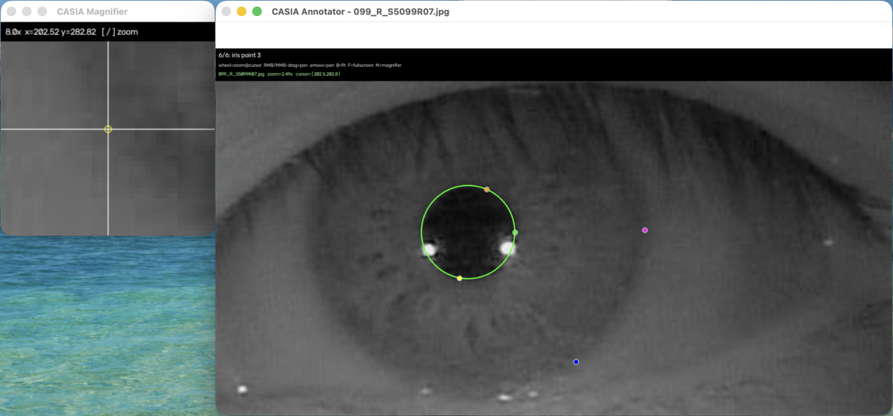

# Documentation
---


## Markup
`markup.py` is a tool for manually annotating iris images.

The application provides two main windows:
 - Annotator — the main annotation window where you place and edit annotation points directly on the image.
 - Magnifier — a separate magnification window that acts like a loupe. It shows an enlarged region around the cursor so you can place annotation points as precisely as possible.


You can use it to annotate the **pupil** and **iris** by selecting **3 points for each circle**. The script calculates the corresponding circle center and radius automatically from these points.

The tool also supports eyelid annotation.

#### Annotator

The **Annotator** is the main working window.

It displays the current eye image and allows you to:

- place annotation points;
- drag already placed points;
- zoom in and out;
- move the visible image area while zoomed in;
- inspect predicted pupil and iris circles when a YOLO model is provided;
- move smoothly from one image to the next without reopening the application window.

When annotating circles, you place:

1. 3 points on the pupil boundary;
2. 3 points on the iris boundary.

The program then calculates both circles automatically.

#### Magnifier

The **Magnifier** is an additional window designed for precise point placement.

It works like a digital loupe and displays a highly enlarged crop of the original image around the current cursor position.

This is especially useful when:

- the iris boundary is difficult to distinguish;
- the pupil edge is blurred;
- eyelashes or reflections are close to the boundary;
- you need pixel-level precision when placing or adjusting points.

The magnifier uses the original image data rather than simply enlarging the already scaled Annotator view. This makes it easier to inspect fine image details accurately.

You can use the Annotator for general navigation and the Magnifier for final precise point placement.

 
### Usage

```bash
> python markup.py --mode circles --input-dir ./images --output-dir ./output
```



### Controls

#### Mouse controls

- **Left Mouse Button (LMB)** — place a new annotation point.
- **LMB on an existing point** — drag and adjust the selected point.
- **Mouse Wheel** — zoom in or out around the current cursor position.
- **Right Mouse Button (RMB) + drag** — move the visible image area while zoomed in.
- **Middle Mouse Button (MMB) + drag** — alternative way to pan the image.
- **Shift + LMB + drag** — alternative panning control.

#### Keyboard controls

- **Enter** — save the current annotation and move to the next image.
- **U** — undo the last placed point.
- **R** — reset all annotation points on the current image.
- **N** — skip the current image.
- **Q** or **Esc** — quit the annotation tool.
- **`+` / `=`** — zoom in.
- **`-`** — zoom out.
- **`0`** — reset the view and fit the image to the Annotator window.
- **`1`** — switch to a 1:1 pixel view.
- **`F`** — toggle fullscreen mode.

#### Magnifier controls

The **Magnifier** follows the cursor position in the Annotator and displays an enlarged crop from the original image.

Use it when the pupil or iris boundary is difficult to distinguish or when pixel-level point placement is required.

- Move the cursor over the image to inspect a region in the Magnifier.
- Use **`[`** to decrease Magnifier zoom.
- Use **`]`** to increase Magnifier zoom.
- The Magnifier can be used while placing or adjusting annotation points.

#### Recommended workflow

1. Open an image in the **Annotator**.
2. Zoom into the eye region using the mouse wheel.
3. Pan the image if the required boundary is outside the current view.
4. Use the **Magnifier** to inspect the exact pupil or iris boundary.
5. Place or adjust the annotation point.
6. Repeat until all required points are placed.
7. Press **Enter** to save the annotation and continue to the next image.

The Annotator keeps the working view between images, which makes it possible to annotate a sequence of similar images without repeatedly resetting the zoom and camera position.

### Arguments

- **`--mode {circles,eyelids}`**  
  Selects the annotation mode.

  - `circles` — annotate the pupil and iris using 3 points for each circle.
  - `eyelids` — annotate the upper and lower eyelids using 3 points for each eyelid.

- **`--input-dir INPUT_DIR`**  
  Path to the directory containing the images that should be annotated.

- **`--output-dir OUTPUT_DIR`**  
  Path to the directory where generated outputs, normalized images, masks, or other annotation results will be saved.

- **`--circle-model CIRCLE_MODEL`**  
  Path to the trained YOLO model weights used for automatic pupil and iris detection.

  This option is particularly useful in `eyelids` mode. The detected pupil and iris circles are used as the geometric basis for eyelid annotation and iris normalization. The eyelid mask can then be applied to the normalized iris image to remove occluded regions.

- **`--log-file LOG_FILE`**  
  Path to the CSV file where annotation results and metadata will be stored.

  Default log files:

  - `annotations_log.csv` — for `circles` mode
  - `annotations_log_2.csv` — for `eyelids` mode

### Circle Annotation

In `circles` mode, annotate the image in the following order:

1. Select 3 points on the pupil boundary.
2. Select 3 points on the iris boundary.

The script calculates:

- pupil center `(cx, cy)`
- pupil radius
- iris center `(cx, cy)`
- iris radius

These values can later be used for iris normalization or for creating a training dataset for object detection models.

### Eyelid Annotation

In `eyelids` mode, annotate:

1. 3 points on the upper eyelid
2. 3 points on the lower eyelid

The points are used to approximate the eyelid curves and generate an eyelid mask.

The mask can then be normalized together with the iris image and used to remove regions occluded by the eyelids.

