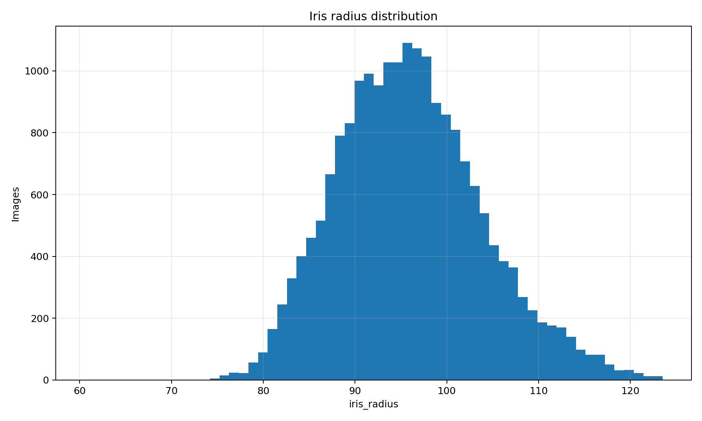
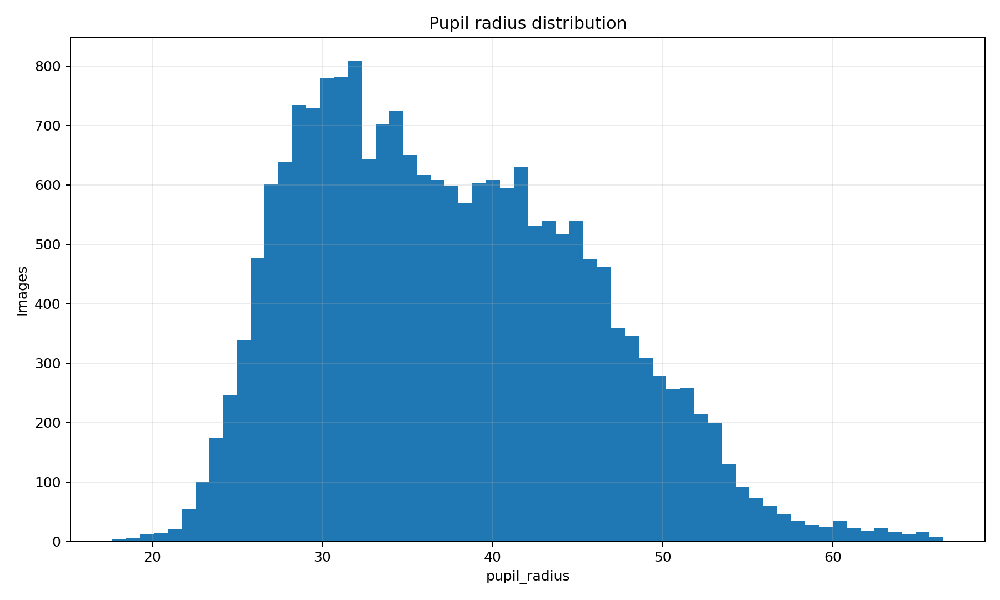
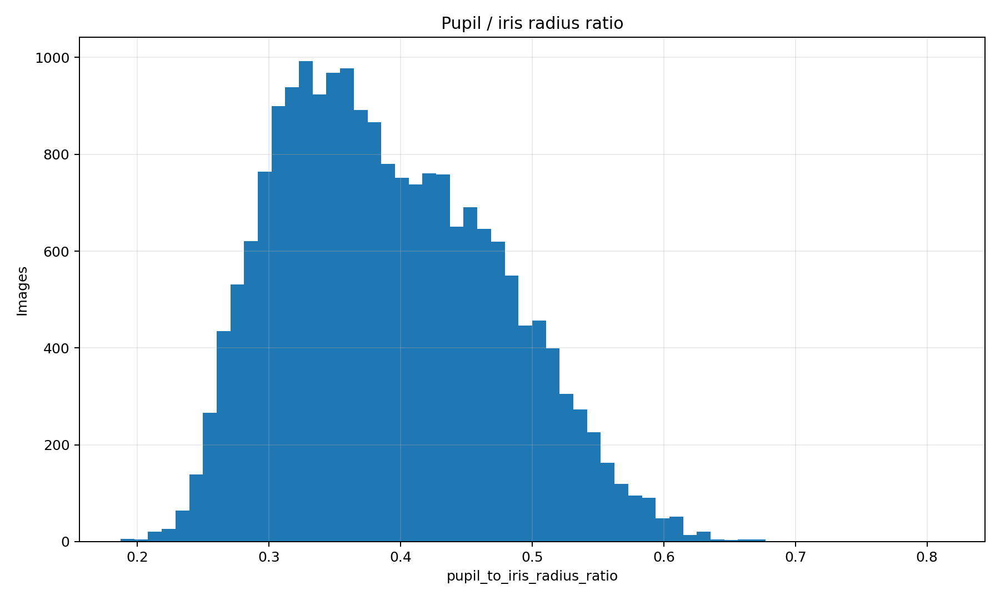

# Statistics for CASIA-THOUSAND

This section presents basic statistics for the CASIA-THOUSAND dataset based on the predicted or manually annotated pupil and iris geometry.

The goal of these plots is to analyze the distribution of iris and pupil sizes across the dataset and to identify unusual samples that may require additional review or manual re-annotation.

## Iris Radius Histogram



This histogram shows the distribution of iris radii across the dataset.

It can be used to:

- estimate the typical iris size in the dataset;
- detect unusually small or large iris predictions;
- identify possible annotation or model prediction errors;
- compare the distribution between different subjects or eye classes.

Samples located far from the main distribution may be considered candidates for additional manual inspection.

## Pupil Radius Histogram



This histogram shows the distribution of pupil radii across all processed images.

The pupil radius can vary significantly because of illumination conditions, pupil dilation, image acquisition conditions, and possible prediction errors.

This plot can help identify:

- typical pupil sizes;
- extremely small or large pupil predictions;
- potential outliers;
- images that may require manual correction.

## Radius Ratio Histogram



This histogram shows the distribution of the ratio between the pupil radius and the iris radius.

The ratio can be defined as:

```text
radius_ratio = pupil_radius / iris_radius
